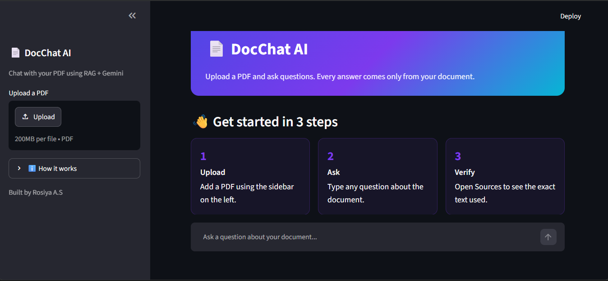
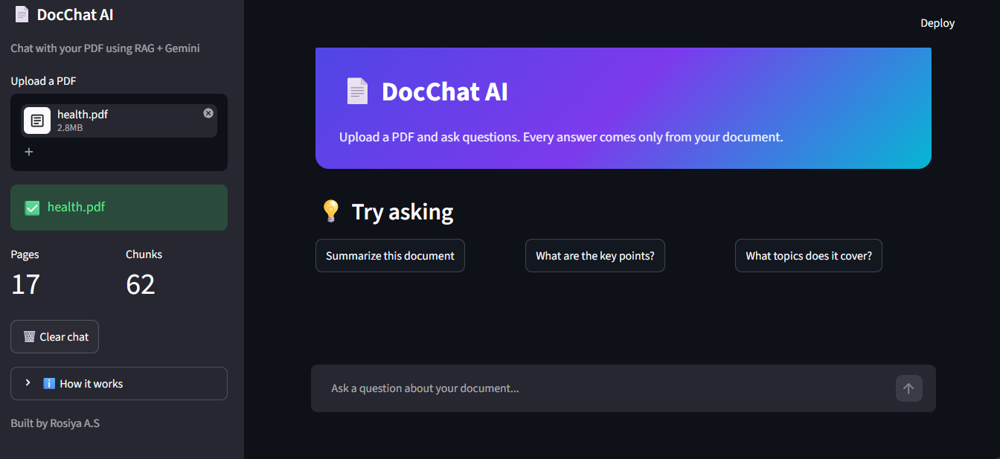
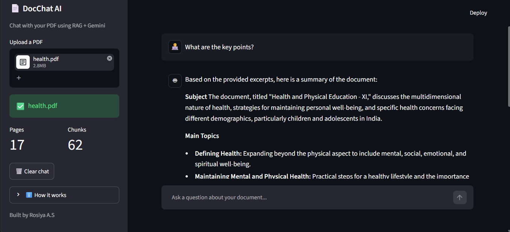

# 📄 RAG Document Q&A Chatbot

A Retrieval-Augmented Generation (RAG) chatbot that answers questions from any uploaded PDF. Answers come only from the document, and the exact source passages and page numbers are shown for verification.

## Features
- Upload any text-based PDF and chat with it
- Answers grounded in the document, with a clear message when the answer isn't found
- Source passages with page numbers for every answer
- Summary mode that samples text from across the whole document
- Automatic retry and fallback models if the LLM API is busy
- Clean Streamlit interface with suggested questions

## How It Works
PDF → split into chunks → embeddings → FAISS vector store → retrieve the most relevant chunks → Gemini answers using only those chunks

1. **Load**: PyPDFLoader reads the PDF page by page
2. **Chunk**: text is split into 800-character pieces with 150 overlap
3. **Embed**: Sentence-Transformers (all-MiniLM-L6-v2) converts chunks into vectors
4. **Store and search**: FAISS finds the chunks closest in meaning to the question
5. **Generate**: Google Gemini answers using only the retrieved context

## Tech Stack
Python, LangChain, Sentence-Transformers, FAISS, Google Gemini API, Streamlit

## Run Locally
1. Clone the repo and open the folder
2. Create and activate a virtual environment: `python -m venv venv` then `venv\Scripts\activate`
3. Install dependencies: `pip install -r requirements.txt`
4. Create a `.env` file with your key: `GOOGLE_API_KEY=your_key_here` (free key from Google AI Studio)
5. Run: `streamlit run app.py`

## Limitations
- Reads text only, so it can't interpret images, colors or layout
- Scanned PDFs without selectable text are not supported

## Author
Rosiya A.S | [LinkedIn](https://www.linkedin.com/in/rosiya-a-s-44a76829b/) | [GitHub](https://github.com/RosiyaAS)